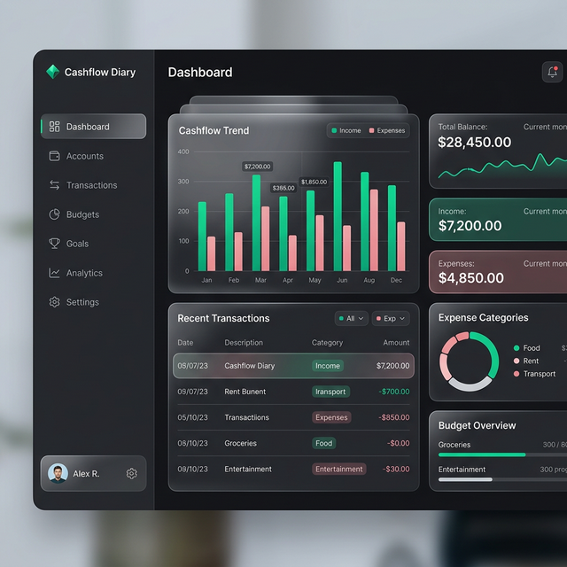

# 📔 Cashflow Diary

**Cashflow Diary** is a premium, minimalistic financial management tool designed for individuals and small businesses to track income, manage expenses, and maintain a synchronous record of debts and credits (Udhaar).



## ✨ Features

-   **🚀 Premium Dashboard**: Real-time summaries of your financial health, including Income, Expenses, and Udhaar totals.
-   **📑 Udhaar Ledger**: A dedicated contact-based ledger to track who owes you and who you owe.
-   **💰 Transaction Management**: Easily record income and expenses with categories and notes.
-   **🏢 Multi-Business Support**: Manage personal finances and multiple business profiles seamlessly within one account.
-   **📊 Smart Reports**: Gain insights into your spending habits with weekly and monthly analytics.
-   **🔑 Minimalistic Auth**: A secure and clean authentication flow (Login/Registration).
-   **🎨 Modern UI**: Built with Tailwind CSS, featuring glassmorphism, smooth animations (AOS), and the elegant Outfit font.

## 🛠️ Tech Stack

-   **Backend**: PHP 7.4+ / 8.0+
-   **Database**: MySQL
-   **Frontend**: Tailwind CSS v3
-   **Animations**: AOS (Animate On Scroll)
-   **Typography**: Outfit (Google Fonts)

## 🚀 Installation

1.  **Clone the repository**:
    ```bash
    git clone https://github.com/your-username/cashflow-diary.git
    cd cashflow-diary
    ```

2.  **Environment Setup**:
    -   Ensure you have a local server environment (like Laragon, XAMPP, or MAMP) with PHP and MySQL.
    -   Create a new database named `cashflow`.

3.  **Run the Installer**:
    -   Access the project in your browser (e.g., `http://localhost/cashflow`).
    -   The system will automatically detect if it's not configured and redirect you to the `install/` directory.
    -   Follow the on-screen instructions to set up your database connection and admin account.

4.  **Login**:
    -   Once installed, log in with your credentials to start managing your cashflow.

## 📁 Project Structure

```text
├── assets/             # Images, CSS, and JS assets
├── auth/               # Login, Registration, and Logout logic
├── businesses/         # Multi-tenant business management
├── config/             # Database configuration
├── contacts/           # Contact management for Udhaar
├── dashboard/          # Main dashboard interface
├── expenses/           # Expense tracking modules
├── includes/           # Core helpers, security, and DB bootstrap
├── income/             # Income tracking modules
├── install/            # One-time installation script
├── reports/            # Financial reporting modules
└── udhaar/             # Debt/Credit ledger management
```

## 📜 License

Distributed under the MIT License. See `LICENSE` for more information.

---

Created with ❤️ by **Ventory Stack**
